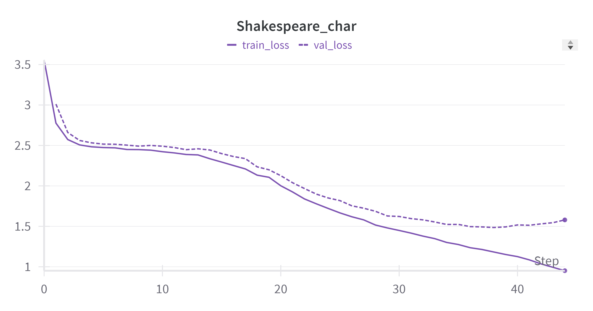

**其他语言: [English](README.md), [中文](README_zh.md).**

# CleanGPT

CleanGPT：一个基于PyTorch实现的[GPT](https://github.com/openai/gpt-2)类模型训练框架。本项目试图保持清晰、简洁、扩展性和教育性，旨在为科研工作提供一个易于使用的工程模板。本项目基于 [NanoGPT](https://github.com/karpathy/nanoGPT) 扩展实现


## 特性
1. **分布式训练**：支持基于 PyTorch DDP 的多卡训练框架
2. **自动混合精度**：支持基于 `torch.cuda.amp` 的混合精度训练
3. **模型编译加速**：支持利用 `torch.compile` 对模型进行编译优化从而加速训练（要求 Pytorch 2.0 及以上版本）
4. **轻量数据加载**：利用 `np.memmap` 构造 Dataloader，不需要将全部数据加载到内存
5. **训练调度器**：提供了强大的训练调度器，支持 learning rate、weight decay coefficient 和训练 batch size 的动态调度，使用早停机制避免过拟合
6. **断点续训**：支持从最新的 snapshot 无感恢复训练过程
7. **模型管理**：提供了实用的 checkpoint 保存管理机制，可根据设定自动保存最好（即验证损失最低）的n个模型权重，且可从指定 checkpoint 初始化进行微调
8. **Wandb Log**：支持在 [Wandb](https://wandb.ai/site) 实时记录训练损失、验证损失、学习率、数据集访问比例等数据曲线
9. **Macro Batch**：由于 Lanuage Model 训练往往使用非常大的数集，整个训练过程可能只遍历数据集几次，甚至无法完整遍历一次，传统的 epoch 概念不再适用。本项目基于 macro-batch 概念进行训练，具体地，batch 是加载数据的最小单位，若干个 batch 组成一个 macro-batch，作为验证损失评估、snapshot & checkpoint 保存的单位
10. **GPT2**: 支持加载 HuggingFace GPT-2 checkpoints 作为初始模型进行微调

## 部署指南
1. 安装 Python 3.9 及以上版本
2. 克隆项目
    ```shell
    git clone https://github.com/wxc971231/CleanGPT.git
    cd CleanGPT
    ```
3. 安装 Pytorch：根据你的 CUDA 版本，在[官网](https://pytorch.org/get-started/previous-versions/)找到安装命令。推荐安装 Pytorch 2.0.1 及以上版本
4. 安装依赖
    ```shell
    pip install -r requirements.txt
    ```

## 训练示例
1. 构造数据集
    ```shell
    cd data/shakespeare_char
    python prepare.py
    ```
2. 在 `train/train_ddp.py` 中的 `get_args_ready` 方法中设置超参数，形如
    ```python
    def get_args_ready(WORLD_SIZE:int, RANK:int):
        args = parse_args()
        args.world_size = WORLD_SIZE

        # model setting
        args.model = 'NanoGPT'
        args.n_position = 1024
        args.n_layer = 6
        args.n_head = 4
        args.n_embed = 384
        args.n_inner = 4 * args.n_embed
        args.dropout = 0.0                          
        args.init_from = None                       

        # optimizer setting
        args.lr_begin = 0                                       
        args.lr_max = 1e-3                          
        args.lr_decay_factor = 10.0                 
        args.lr_warmup_ratio = 0.05
        args.lr_decay_ratio = 0.95
        args.lr_decay_style = "cosine"
        args.wd_begin = 1e-3                        
        args.wd_end = args.wd_begin                 
        args.wd_decr_style = "constant"            
        args.ga_begin = 2                           
        args.ga_end = args.ga_begin                 
        args.grad_accum_step_incr_style = "constant"
        args.adam_beta2 = 0.99                      
        ...
    ```
    所有超参数的详细解释可在 `train/config.py` 中找到。相比通过命令行传入参数，这样显式固定训练超参数更加清晰，且可通过保存训练脚本保证可复现性
3. 启动训练，目前仅支持单机多卡并行。Checkpoint & Snapshot 将保存于 `out` 路径下
    ```shell
    CUDA_VISIBLE_DEVICES=0,1,2,3 torchrun --standalone --nproc_per_node=gpu ./train/train_ddp.py 
    ```
    通常我们会训练到过拟合，直到触发早停
    
4. 评估最优 Checkpoint。将训练过程中生成的输出文件路径粘贴到 `eval/text_autoregress.py` 中，会自动加载最优 Checkpoint 进行自回归生成。用 TinyStory 数据集训练的一个示例如下：
    ```text
    Once upon a time, 3 year old girl named Lucy wanted to go on an adventure. She asked her mom if she could go. Her mom said yes, but only if she stayed close.
    Lucy was so excited! She ran outside and started exploring. She found a big tree and decided to climb it. She climbed higher and higher until she was at the top.
    At the top, Lucy looked around and saw a beautiful view. She wanted to stay and enjoy it for a while. Then she carefully climbed down and ran back home.
    When she got home, her mom asked her what she was doing. Lucy said, "I'm going on an adventure!" Her mom smiled and said, "That sounds like a great idea!"
    Lucy was so happy. She had a wonderful time exploring and eating the view. She was so glad she had stayed close to home.</s>
    ```


## TODO

| Item  | Note  |
|-------|-----|
| 支持混合数据集训练 | -  |
| 支持 llama 模型 | Done (hugging face llama)  | 
| 支持 kvcahce | Done (for llama) |
| 支持 RLHF | - |
| 支持多模态输入|-|
| 将本项目扩展至类似 [Gato](https://arxiv.org/pdf/2205.06175) 的控制任务|-|